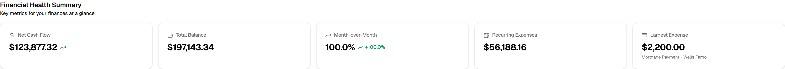
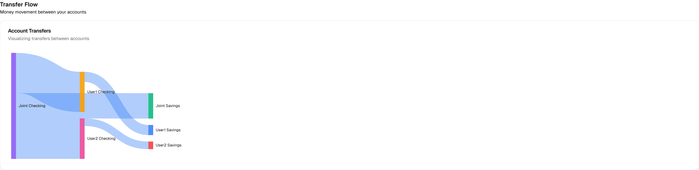
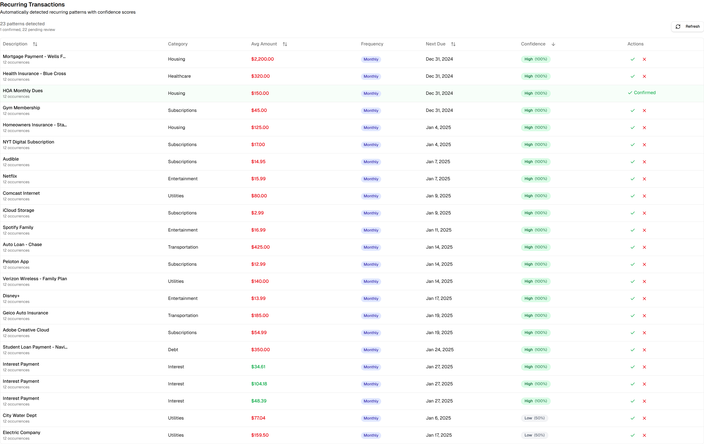

# Home Finance Dashboard

A comprehensive personal finance dashboard for tracking income, expenses, and financial health. Monitor your cash flow, visualize spending patterns, and gain actionable insights into your financial position—all in one place.


---

## Features

### 📊 Financial Health at a Glance

View your complete financial summary instantly with 5 key metrics: **Net Cash Flow**, **Total Balance**, **Month-over-Month Change**, **Recurring Expenses**, and **Largest Expense**. Trend indicators show whether you're improving or need attention.



### 📈 Cash Flow Visualization

Track income vs. expenses over time with an intuitive bar chart. Income appears in mint green, expenses in coral. Transfers between accounts are automatically excluded to prevent double-counting. See exactly which months you saved money and which you overspent.

### 🏷️ Spending by Category

Understand where your money goes with interactive donut and bar charts. Categories are sorted by spending amount, making it easy to identify your top expenses. Click any category to drill down into individual transactions.

### 💰 Account Balance Trends

Monitor how your account balances change over time with a multi-line chart. Each account has its own color-coded line. Toggle accounts on/off to focus on specific ones, and watch your savings grow or debts decrease.

### 🔄 Transfer Flow Between Accounts

Visualize money movement between accounts with a Sankey flow diagram. Connection widths represent transfer amounts, giving you a clear picture of how funds flow through your financial ecosystem.



### 🔁 Automatic Recurring Transaction Detection

Let the system identify recurring expenses like subscriptions, mortgage payments, and bills. Each pattern includes:
- **Average amount** and **frequency** (weekly/monthly)
- **Next expected date** for better planning
- **Confidence score** (High/Medium/Low) based on consistency
- Confirm or reject detections with one click



### 📋 Complete Transaction History

View, search, sort, and export all transactions in a powerful data table. Sort by any column, search descriptions or categories, and export filtered results to CSV for external analysis.


### 🎛️ Advanced Filtering

Filter your entire dashboard by:
- **Time period**: Quick buttons (This Month, Last Month, Last 3 Months, Last 6 Months, YTD, Last 12 Months, All Time) or custom date range
- **Accounts**: Multi-select to focus on specific accounts

All charts and metrics update instantly based on your filters.

---

## Tech Stack

**Frontend & Framework**
- **Next.js 16** - React framework with App Router
- **React 19** - UI library
- **TypeScript 5** - Type safety
- **Tailwind CSS 4** - Styling

**Data & Backend**
- **Microsoft SQL Server 2025** - Database (Docker)
- **Prisma 7** - ORM with MSSQL adapter
- **Zod** - Schema validation

**Charts & UI Components**
- **Recharts 3.6** - Chart library
- **Radix UI** - Accessible component primitives
- **shadcn/ui** - Beautiful component library
- **TanStack React Table 8** - Powerful table component

**Testing & Development**
- **Vitest** - Unit & integration testing
- **Playwright** - End-to-end testing
- **Testing Library** - React component testing
- **Testcontainers** - Isolated database testing

---

## Quick Start

### Prerequisites

- **Docker** & **Docker Compose** installed
- **Node.js 20+** (if running development mode)

### 1. Clone the Repository

```bash
git clone <repository-url>
cd Home-Dashboard
```

### 2. Start the Application

```bash
docker compose up -d
```

This will:
- Start Microsoft SQL Server 2025 database (port **1434**)
- Initialize the database with schema and seed data
- Build and launch the Next.js web application (port **3000**)

### 3. Access the Dashboard

Open your browser and navigate to:

```
http://localhost:3000
```

The dashboard comes pre-loaded with **1,116 sample transactions** across **6 accounts** (Joint Checking/Savings, User1 Checking/Savings, User2 Checking/Savings) spanning the full year of 2024.

### Stopping the Application

```bash
docker compose down
```

Your data persists in a Docker volume (`mssql-data`), so it's safe to stop and restart without losing information.

---

## Sample Data

The included dataset provides a realistic view of household finances:

- **1,116 transactions** from January 1 - December 31, 2024
- **6 accounts**: Joint Checking, Joint Savings, User1 Checking, User1 Savings, User2 Checking, User2 Savings
- **Categories**: Housing, Transportation, Groceries, Dining, Utilities, Healthcare, Entertainment, Subscriptions, Debt, Gifts, Charity, and more
- **Recurring expenses**: Mortgage, insurance, subscriptions, bills automatically detected
- **Income streams**: Salaries, bonuses, interest payments
- **Transfers**: Inter-account transfers and savings allocations

---

## Database Access

If you need to access the database directly:

**Connection String:**
```
Server=localhost,1434;Database=HomeFinance-db;User Id=sa;Password=YourStrong@Password123;TrustServerCertificate=true
```

**SQL Command Line (via Docker):**
```bash
docker exec -it cemdash-db /opt/mssql-tools18/bin/sqlcmd \
  -S localhost -U sa -P 'YourStrong@Password123' \
  -d HomeFinance-db -C
```

**Prisma Studio (Visual Database Browser):**
```bash
npm install  # Install dependencies first
npx prisma studio
```

---

## Project Structure

```
Home-Dashboard/
├── app/                    # Next.js App Router pages & API routes
│   ├── dashboard/         # Dashboard page components
│   ├── api/              # Backend API endpoints
│   └── globals.css       # Global styles
├── components/            # React components
│   ├── dashboard/        # Dashboard-specific components
│   │   ├── charts/      # Chart components (Recharts)
│   │   ├── filters/     # Filter components
│   │   └── transactions/ # Transaction tables
│   └── ui/              # shadcn/ui base components
├── lib/                  # Utility libraries
│   ├── queries/         # Prisma database queries
│   ├── contexts/        # React contexts (filters)
│   ├── validations/     # Zod schemas
│   └── db.ts           # Database connection
├── prisma/              # Prisma ORM schema
│   └── schema.prisma   # Database schema definition
├── public/              # Static assets
│   └── screenshots/    # Dashboard screenshots
├── __tests__/           # Test suites
│   ├── unit/           # Unit tests (Vitest)
│   ├── integration/    # Integration tests (Vitest)
│   └── e2e/           # End-to-end tests (Playwright)
├── docker-compose.yml   # Docker services configuration
└── Dockerfile          # Next.js app container
```

---

## License

MIT License - feel free to use this project as a foundation for your own financial dashboards.

---

## Support

For questions or issues, please refer to the documentation in the `/specs` directory or examine the test files in `__tests__/` for usage examples.
