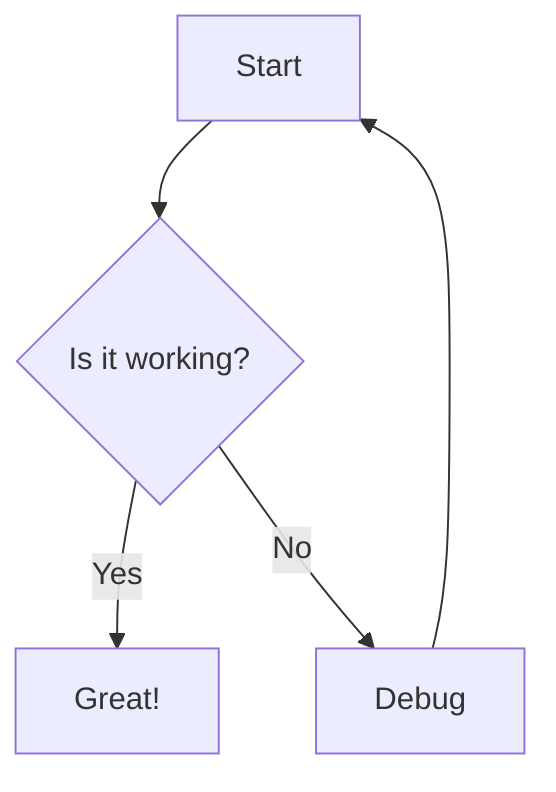

# Welcome to Documentation

This is a sample markdown file for the Markdown Reader feature.

## Features

- File tree navigation
- Syntax-highlighted code blocks
- Mermaid diagram support

## Example Code

```typescript
function greet(name: string): string {
  return `Hello, ${name}!`;
}
```

## Example Diagram



