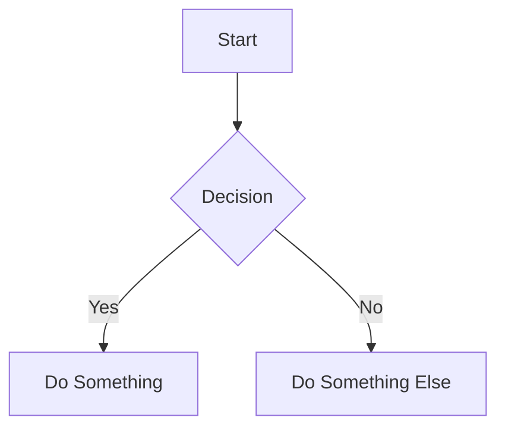

# Quickstart: Markdown Reader

**Feature**: 005-markdown-reader
**Branch**: `005-markdown-reader`

## Overview

This guide helps developers get started with the Markdown Reader feature implementation. The reader provides a read-only document viewer for markdown files, Mermaid diagrams, and plain text from a Docker-mounted volume.

---

## Prerequisites

1. **Development environment** - Node.js 20+, Docker, VS Code
2. **Repository cloned** and on the feature branch:
   ```bash
   git checkout 005-markdown-reader
   ```
3. **Dependencies installed**:
   ```bash
   npm install
   ```
4. **Database running**:
   ```bash
   docker compose up -d
   ```

---

## New Dependencies

Install the feature-specific dependencies:

```bash
npm install react-markdown remark-gfm shiki mermaid
```

| Package | Purpose |
|---------|---------|
| `react-markdown` | Markdown → React component rendering |
| `remark-gfm` | GitHub Flavored Markdown support (tables, strikethrough) |
| `shiki` | VS Code-quality syntax highlighting |
| `mermaid` | Diagram rendering (flowcharts, sequences, etc.) |

---

## Environment Setup

### 1. Create Documentation Directory

Create a test documentation directory on your host machine:

```bash
mkdir -p ~/cemdash-docs
echo "# Welcome\n\nTest documentation." > ~/cemdash-docs/README.md
```

### 2. Add Environment Variable

Add to `.env.local`:

```env
# Documentation root directory (container path)
DOCS_ROOT=/app/docs
```

### 3. Update Docker Compose

Add the documentation volume mount to `docker-compose.yml`:

```yaml
services:
  cemdash:
    # ... existing config ...
    volumes:
      - ./data:/app/data                    # Existing
      - ~/cemdash-docs:/app/docs            # NEW: Documentation mount
    environment:
      - DOCS_ROOT=/app/docs                 # NEW: Tell app where docs are
```

**Note**: The mount should NOT be `:ro` (read-only) because we need to write `.reader-prefs.json` for preferences.

---

## Project Structure

After implementation, the feature adds:

```
app/
├── reader/
│   ├── layout.tsx              # Reader layout with context provider
│   ├── page.tsx                # Default page (empty state)
│   └── [[...path]]/
│       └── page.tsx            # Dynamic file path handling
└── api/
    └── reader/
        ├── tree/route.ts       # Directory listing
        ├── file/route.ts       # File content
        ├── search/route.ts     # File search
        ├── preferences/route.ts # Favorites & recents
        └── image/route.ts      # Image serving

components/reader/
├── ReaderLayout.tsx            # Main layout orchestrator
├── navigation/                 # File tree, search, recents, favorites
├── content/                    # Markdown rendering, TOC, code blocks
├── controls/                   # Display mode toggle, refresh, favorite
└── mobile/                     # Mobile drawer navigation

lib/reader/
├── file-system.service.ts      # Sandboxed file operations
├── preferences.service.ts      # Read/write preferences
├── markdown-config.ts          # Plugins configuration
├── shiki-highlighter.ts        # Syntax highlighting setup
└── mermaid-themes.ts           # Diagram theme config

lib/contexts/
└── ReaderContext.tsx           # Reader state management

lib/validations/
└── reader.ts                   # Zod schemas
```

---

## Key Files to Understand

### 1. FileSystemService (`lib/reader/file-system.service.ts`)

Core server-side service for file operations with path security:

```typescript
// Key methods:
getTree(relativePath?: string)  // List directory contents
getFile(relativePath: string)   // Read file content
searchFiles(query: string)      // Search by filename
validatePath(path: string)      // Security validation
```

### 2. ReaderContext (`lib/contexts/ReaderContext.tsx`)

Client-side state management for the reader:

```typescript
// Provides:
- currentFile, currentPath       // Current document
- expandedPaths                  // Tree state
- searchQuery, searchResults     // Search
- displayMode                    // themed/reading
- favorites, recentFiles         // Quick access
- selectFile(), toggleFavorite() // Actions
```

### 3. MarkdownRenderer (`components/reader/content/MarkdownRenderer.tsx`)

Main content rendering with react-markdown:

```typescript
// Features:
- CommonMark + GFM parsing
- Custom code block handling (Shiki)
- Mermaid diagram detection
- Smart link routing
- Heading extraction for TOC
```

---

## Development Workflow

### TDD Red-Green-Refactor

Follow strict TDD for all implementation:

1. **RED**: Write failing test
2. **GREEN**: Implement minimum code to pass
3. **REFACTOR**: Clean up while tests pass

### Example: FileSystemService

```bash
# 1. Create test file
touch __tests__/unit/lib/reader/file-system.service.test.ts

# 2. Write failing test
# Test: validatePath rejects path traversal

# 3. Run test (should fail)
npm test -- file-system.service

# 4. Implement validatePath
# 5. Run test (should pass)
# 6. Refactor if needed
```

---

## Testing

### Unit Tests

```bash
# Run all reader tests
npm test -- reader

# Run specific test file
npx vitest run __tests__/unit/lib/reader/file-system.service.test.ts

# Watch mode
npx vitest __tests__/unit/lib/reader
```

### Integration Tests (API)

```bash
# Run API integration tests
npx vitest run __tests__/integration/api/reader
```

### E2E Tests

```bash
# Run Playwright tests
npm run test:e2e -- reader.spec.ts

# With UI
npm run test:e2e:ui -- reader.spec.ts
```

---

## Local Development

### Start Development Server

```bash
# Start database first
docker compose up -d

# Then start Next.js (or use full Docker setup)
npm run dev
```

### Access the Reader

Navigate to: http://localhost:3000/reader

### Test Documentation

Add test files to your docs directory:

```bash
# Markdown file
cat > ~/cemdash-docs/test.md << 'EOF'
# Test Document

This is a **test** document with:

- Lists
- `inline code`
- [Links](https://example.com)

```javascript
const hello = "world";
console.log(hello);
```

## Mermaid Diagram


EOF

# Mermaid file
cat > ~/cemdash-docs/flow.mmd << 'EOF'
sequenceDiagram
    Alice->>Bob: Hello Bob!
    Bob-->>Alice: Hi Alice!
EOF
```

---

## Authentication

The reader requires authentication (Constitution Principle VI).

### Middleware Updates

Add to `middleware.ts` matcher:

```typescript
export const config = {
  matcher: [
    // ... existing routes ...
    "/reader/:path*",        // NEW: Reader pages
    "/api/reader/:path*",    // NEW: Reader API
  ],
};
```

---

## Common Tasks

### Add New Supported File Type

1. Update `lib/reader/file-system.service.ts`:
   ```typescript
   const ALLOWED_EXTENSIONS = ['.md', '.mmd', '.txt', '.NEW'];
   ```

2. Update `lib/validations/reader.ts`:
   ```typescript
   extension: z.enum(['.md', '.mmd', '.txt', '.NEW']),
   ```

3. Handle rendering in `ContentViewer.tsx`

### Add New Language for Syntax Highlighting

Update `lib/reader/shiki-highlighter.ts`:

```typescript
const highlighter = await getHighlighter({
  // ...
  langs: ['typescript', 'javascript', /* add new lang */],
});
```

### Customize Mermaid Theme

Update `lib/reader/mermaid-themes.ts`:

```typescript
export const themedConfig = {
  theme: 'dark',
  themeVariables: {
    primaryColor: '#FF6B6B',  // Coral
    // ... customize
  },
};
```

---

## Debugging Tips

### Path Validation Issues

Add debug logging to `file-system.service.ts`:

```typescript
console.log('Validating path:', {
  input: relativePath,
  normalized: path.normalize(relativePath),
  resolved: path.resolve(this.docsRoot, relativePath),
  docsRoot: this.docsRoot,
});
```

### Mermaid Rendering Errors

Check browser console for Mermaid errors. Invalid syntax shows error message in UI.

### Preferences Not Saving

Verify:
1. Docker volume is NOT read-only (`:ro`)
2. Check container has write permissions
3. Look for `.reader-prefs.json` in docs directory

---

## Reference Documents

| Document | Purpose |
|----------|---------|
| [spec.md](./spec.md) | Feature requirements and user stories |
| [plan.md](./plan.md) | Technical architecture and decisions |
| [research.md](./research.md) | Technology research and rationale |
| [data-model.md](./data-model.md) | TypeScript interfaces and Zod schemas |
| [contracts/reader-api.yaml](./contracts/reader-api.yaml) | OpenAPI specification |
| [tasks.md](./tasks.md) | Implementation task checklist (after /speckit.tasks) |

---

## Getting Help

- **Constitution violations?** Check `.specify/memory/constitution.md`
- **API contract questions?** See `contracts/reader-api.yaml`
- **Type definitions?** See `data-model.md`
- **Decision rationale?** See `research.md`
